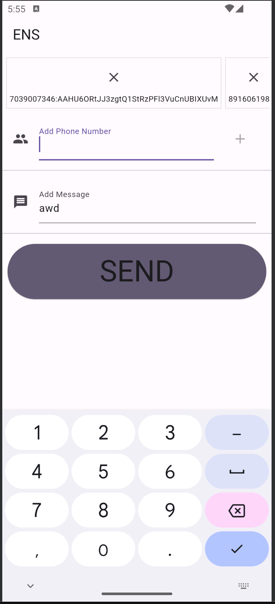

# ENS

## Парахин Николай Викторович

Данный проект является MVP Системы Экстренной Нотификации, который позволяет отправлять множество сообщений на несколько устройств одновременно по разным протоколам связи: по SSH, SMS, HTTP (в данном случае на сервер с определенным телеграм API).

Проект содержит в себе две части: Python сервер и Flutter приложение.

Использован BLoC, SharedPreferences в качестве бд, написан один UnitTest (но) в него нужно записать данные для проверки, так как необходим ключ.
